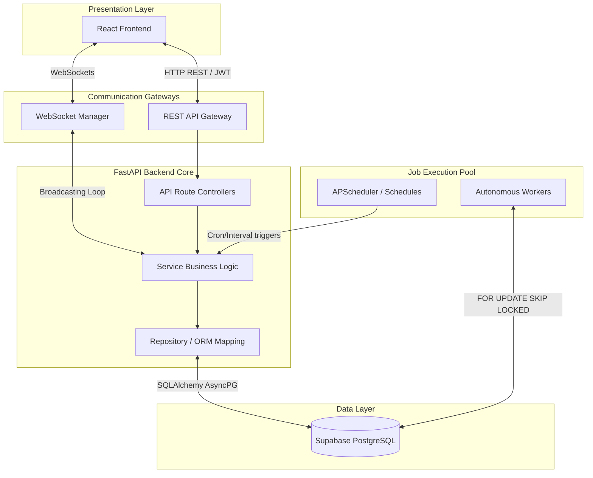
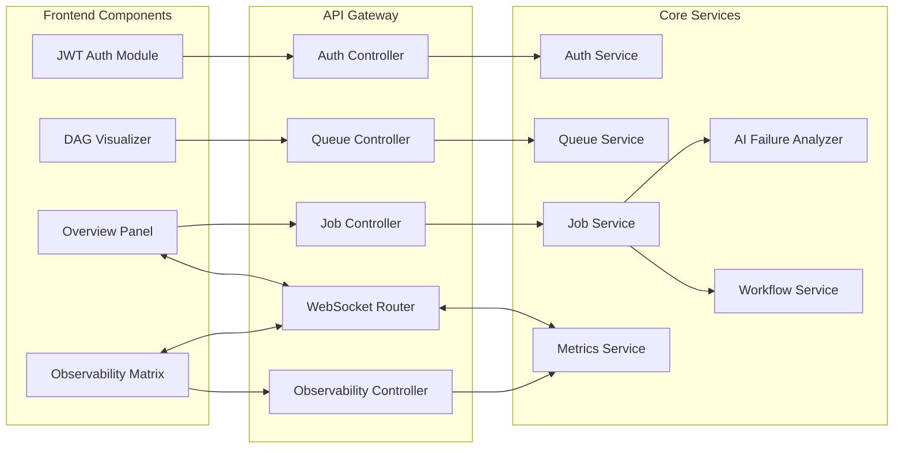
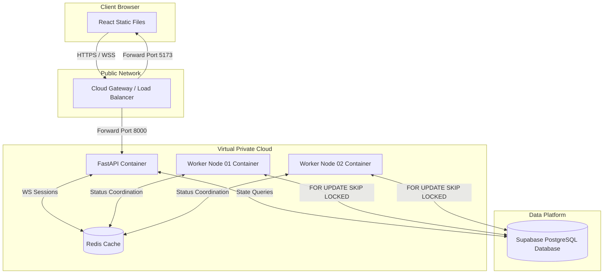
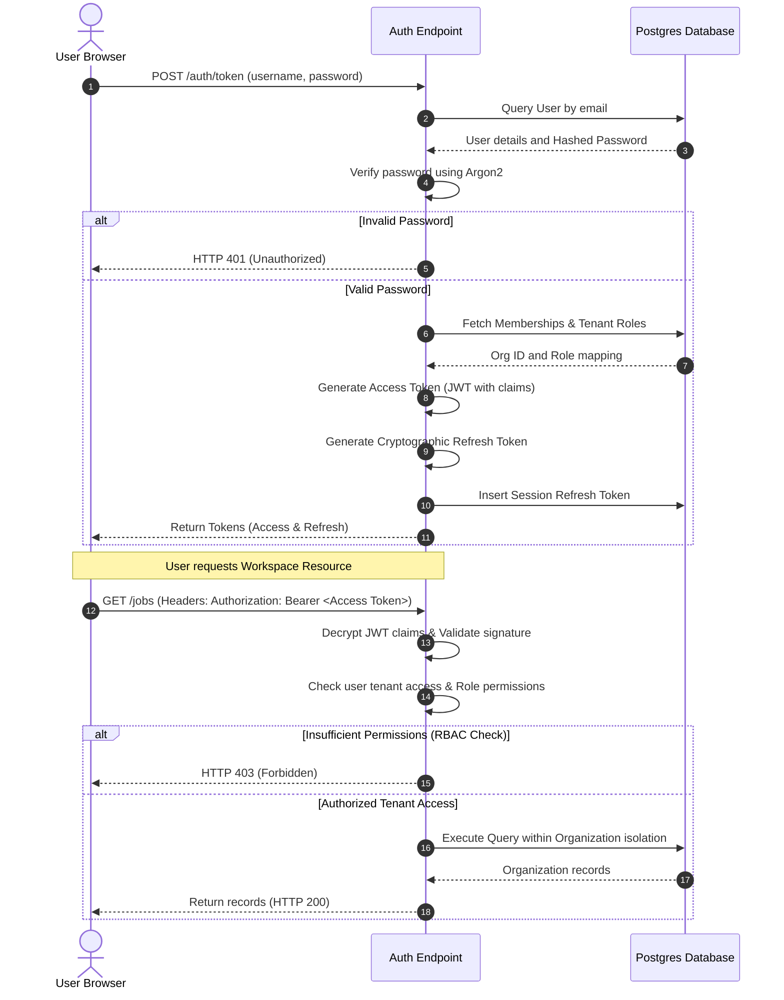
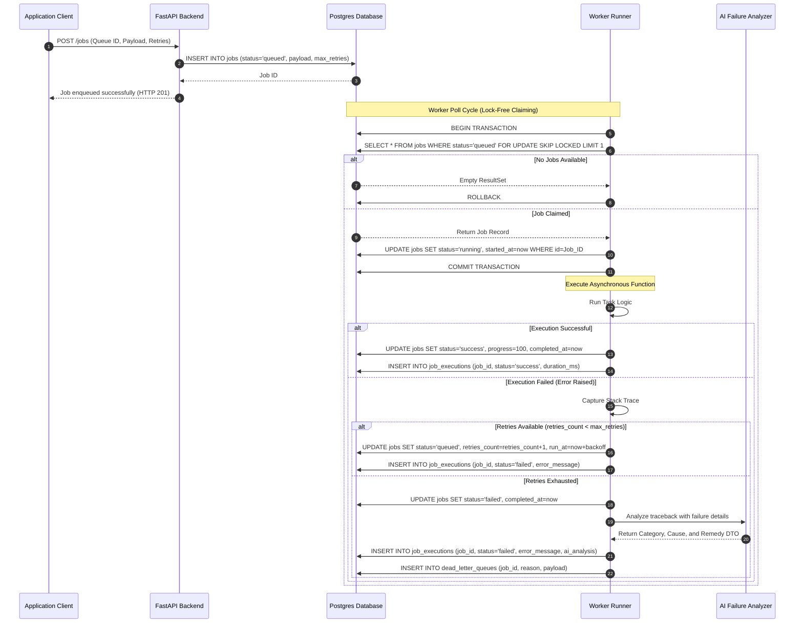
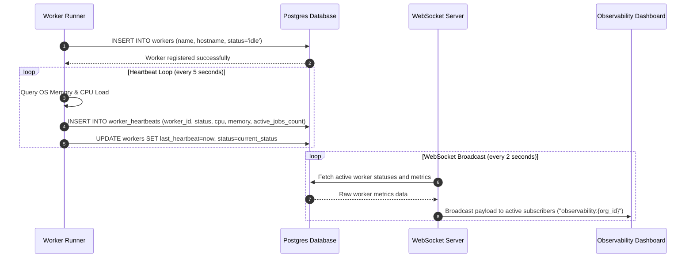
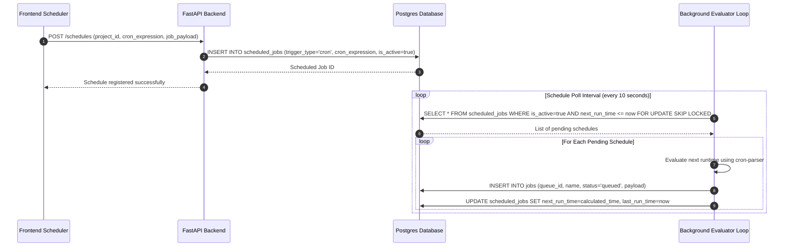

# AetherFlow Architecture Documentation

This document provides a comprehensive technical overview of the **AetherFlow** system architecture, component layout, backend layers, deployment model, and execution flows. 

---

## 1. High-Level System Architecture

AetherFlow uses a modular, decoupled architecture connecting a premium, state-of-the-art React frontend with an asynchronous Python FastAPI backend. The backend operates on a 3-layer pattern (API Router -> Service -> Repository/ORM) backed by a PostgreSQL database. Real-time updates are driven by persistent WebSocket connections.



### Component Descriptions:
- **React Frontend**: A single-page application built on Vite, React 18, Zustand, and TanStack React Query. It displays real-time job and worker telemetry via WebSockets and REST.
- **FastAPI Backend**: Asynchronous gateway utilizing Python 3.11. Exposes REST endpoints, validates auth headers, manages connections, and runs background broadcasts.
- **Service Layer**: Houses the business logic for state transitions, AI failure evaluations, DAG graph traversal, and queue state changes.
- **Repository / ORM Layer**: Leverages SQLAlchemy 2.0 async session pools to interface with the database.
- **Autonomous Workers**: Node processes running concurrently to fetch, lock, execute, and record jobs.
- **Scheduler**: Evaluation engine that tracks interval and cron schedules, dispatching jobs automatically.
- **WebSockets**: Bi-directional communication channel used to push alert toasts and metrics to clients.

---

## 2. Component Diagram

The component diagram details the interaction between the React frontend modules and the FastAPI backend services.



---

## 3. Backend Layer Diagram

The backend utilizes strict layering to isolate HTTP logic from database transactions.

```
+-------------------------------------------------------------+
|                         API LAYER                           |
|  - fastapi.APIRouter (auth.py, jobs.py, queues.py, etc.)   |
|  - Pydantic Validation Schemas (dto.py)                     |
|  - CORS and Rate Limiting Middlewares                       |
+-------------------------------------------------------------+
                              |
                              v
+-------------------------------------------------------------+
|                       SECURITY LAYER                        |
|  - JWT Bearer Header Verification                           |
|  - Tenancy Isolation Filter (checks organizational ID)      |
|  - RBAC Checks (RequirePermission Middleware)               |
+-------------------------------------------------------------+
                              |
                              v
+-------------------------------------------------------------+
|                        SERVICE LAYER                        |
|  - Business Logic (job_service.py, queue_service.py, etc.)  |
|  - Failure Analysis parsing (failure_analyzer.py)          |
|  - WebSocket push message generation (notification_service) |
+-------------------------------------------------------------+
                              |
                              v
+-------------------------------------------------------------+
|                      ORM & REPO LAYER                       |
|  - SQLAlchemy 2.0 Declarative Models (core.py)              |
|  - AsyncSession context managers                           |
|  - Skip Locked transaction executions                       |
+-------------------------------------------------------------+
                              |
                              v
+-------------------------------------------------------------+
|                       DATABASE LAYER                        |
|  - Supabase PostgreSQL (schema, triggers, constraints)      |
+-------------------------------------------------------------+
```

---

## 4. Deployment Architecture

AetherFlow is optimized for Docker containerization and cloud-native services.



---

## 5. Authentication Flow

AetherFlow implements multi-tenant token-based authentication using JSON Web Tokens (JWT) with hierarchical role permissions.



---

## 6. Job Processing Flow

This diagram illustrates the lifecycle of a job, from creation to worker execution, retry handling, and dead-letter queue transition.



---

## 7. Worker Communication Flow

Workers act as decoupled, stateless runners. They register and report metrics independently.



---

## 8. Scheduler Flow

AetherFlow manages interval and cron schedules inside the database. A background evaluator loop triggers the job creation on schedule intervals.



---

## 9. Key Database Architectural Patterns

### 1. Lock-Free Skipping (`SKIP LOCKED`)
AetherFlow uses the PostgreSQL concurrency feature `SELECT ... FOR UPDATE SKIP LOCKED`.
- **How it works**: When a worker attempts to claim a task, it issues a SELECT query that locks matching rows. If a row is already locked by another worker transaction, instead of waiting (which causes blocking and bottlenecks), the database engine skips the row and returns the next unlocked row.
- **Benefit**: Multi-core worker nodes scale horizontally without hitting thread contentions, deadlocks, or task double-claiming bugs.

### 2. Tenancy Partitioning
All primary models (`Project`, `Queue`, `Job`, `Workflow`, `ScheduledJob`, `Notification`, `AuditLog`) resolve back to an `Organization` relationship.
- Every API controller extracts the `organization_id` (either from the JWT token claims or a route parameter) and appends a `WHERE organization_id = [ID]` predicate to every query.
- This guarantees data isolation between organizations.
