# AetherFlow Entity-Relationship (ER) Diagram

This document contains the complete Entity-Relationship (ER) model representing the AetherFlow 3NF relational database schema.

---

## 1. Database ER Diagram

The following Mermaid diagram displays all tables, their attributes (including Primary Keys `PK` and Foreign Keys `FK`), and the relationships connecting them.

```mermaid
erDiagram
    users {
        uuid id PK
        varchar first_name
        varchar last_name
        varchar username
        varchar full_name
        varchar email
        varchar hashed_password
        varchar phone
        varchar country
        varchar timezone
        varchar profile_picture
        boolean is_verified
        boolean is_active
        integer login_attempts
        timestamp locked_until
        timestamp last_login
        timestamp created_at
        timestamp updated_at
        timestamp deleted_at
        uuid created_by FK
        uuid updated_by FK
        integer version
    }

    organizations {
        uuid id PK
        varchar name
        varchar slug
        text description
        uuid owner_id FK
        varchar logo
        varchar plan
        varchar status
        timestamp created_at
        timestamp updated_at
        timestamp deleted_at
        uuid created_by FK
        uuid updated_by FK
        integer version
    }

    memberships {
        uuid id PK
        uuid user_id FK
        uuid organization_id FK
        varchar role
        timestamp created_at
        timestamp updated_at
        timestamp deleted_at
        uuid created_by FK
        uuid updated_by FK
        integer version
    }

    projects {
        uuid id PK
        uuid organization_id FK
        varchar name
        varchar slug
        text description
        varchar environment
        varchar status
        timestamp created_at
        timestamp updated_at
        timestamp deleted_at
        uuid created_by FK
        uuid updated_by FK
        integer version
    }

    retry_policies {
        uuid id PK
        varchar name
        varchar type
        integer delay
        integer max_attempts
        numeric backoff_factor
        uuid job_id
        uuid queue_id
        timestamp created_at
        timestamp updated_at
        timestamp deleted_at
        uuid created_by FK
        uuid updated_by FK
        integer version
    }

    queues {
        uuid id PK
        uuid project_id FK
        varchar name
        integer priority
        integer concurrency_limit
        uuid retry_policy_id FK
        boolean is_paused
        boolean is_active
        integer rate_limit
        timestamp created_at
        timestamp updated_at
        timestamp deleted_at
        uuid created_by FK
        uuid updated_by FK
        integer version
    }

    workers {
        uuid id PK
        varchar name
        varchar hostname
        varchar ip_address
        varchar status
        numeric cpu_usage
        numeric memory_usage
        integer active_jobs
        jsonb system_info
        timestamp last_heartbeat
        timestamp created_at
        timestamp updated_at
        timestamp deleted_at
        uuid created_by FK
        uuid updated_by FK
        integer version
    }

    jobs {
        uuid id PK
        uuid queue_id FK
        uuid worker_id FK
        varchar name
        jsonb payload
        jsonb result
        integer progress
        text error_message
        varchar status
        integer priority
        timestamp run_at
        timestamp scheduled_at
        timestamp started_at
        timestamp completed_at
        integer attempts
        integer max_attempts
        integer retries_count
        integer max_retries
        integer execution_timeout
        uuid parent_id FK
        timestamp created_at
        timestamp updated_at
        timestamp deleted_at
        uuid created_by FK
        uuid updated_by FK
        integer version
    }

    scheduled_jobs {
        uuid id PK
        uuid project_id FK
        varchar name
        varchar trigger_type
        varchar cron_expression
        integer interval_seconds
        uuid target_queue_id FK
        varchar job_name
        jsonb job_payload
        boolean is_active
        timestamp next_run_time
        timestamp created_at
        timestamp updated_at
        timestamp deleted_at
        uuid created_by FK
        uuid updated_by FK
        integer version
    }

    job_executions {
        uuid id PK
        uuid job_id FK
        uuid worker_id FK
        varchar status
        timestamp started_at
        timestamp finished_at
        timestamp completed_at
        integer execution_time
        integer duration_ms
        numeric cpu_usage
        numeric memory_usage
        jsonb response
        text error_message
        text stack_trace
        jsonb ai_analysis
        timestamp created_at
        timestamp updated_at
        timestamp deleted_at
        uuid created_by FK
        uuid updated_by FK
        integer version
    }

    worker_heartbeats {
        uuid id PK
        uuid worker_id FK
        timestamp heartbeat_time
        varchar status
        numeric cpu
        numeric memory
        numeric disk
        integer active_jobs_count
        timestamp created_at
        timestamp updated_at
        timestamp deleted_at
        uuid created_by FK
        uuid updated_by FK
        integer version
    }

    job_logs {
        uuid id PK
        uuid job_execution_id FK
        uuid job_id FK
        varchar log_level
        varchar level
        text message
        text stack_trace
        timestamp timestamp
        timestamp created_at
        timestamp updated_at
        timestamp deleted_at
        uuid created_by FK
        uuid updated_by FK
        integer version
    }

    dead_letter_queues {
        uuid id PK
        uuid job_id FK
        timestamp failed_at
        text reason
        jsonb payload
        timestamp created_at
        timestamp updated_at
        timestamp deleted_at
        uuid created_by FK
        uuid updated_by FK
        integer version
    }

    notifications {
        uuid id PK
        varchar title
        text message
        varchar type
        boolean read_status
        uuid organization_id FK
        timestamp sent_at
        varchar status
        timestamp created_at
        timestamp updated_at
        timestamp deleted_at
        uuid created_by FK
        uuid updated_by FK
        integer version
    }

    audit_logs {
        uuid id PK
        varchar action
        varchar entity_type
        uuid entity_id
        uuid user_id FK
        jsonb changes
        varchar ip_address
        timestamp created_at
        timestamp updated_at
        timestamp deleted_at
        uuid created_by FK
        uuid updated_by FK
        integer version
    }

    refresh_tokens {
        uuid id PK
        uuid user_id FK
        varchar token
        timestamp expires_at
        boolean is_revoked
        timestamp revoked_at
        varchar device_info
        uuid token_family
        timestamp created_at
        timestamp updated_at
        timestamp deleted_at
        uuid created_by FK
        uuid updated_by FK
        integer version
    }

    %% Relationships
    users ||--o{ organizations : "owns"
    users ||--o{ memberships : "holds"
    organizations ||--o{ memberships : "contains"
    organizations ||--o{ projects : "isolates"
    projects ||--o{ queues : "manages"
    projects ||--o{ scheduled_jobs : "defines"
    queues ||--o{ scheduled_jobs : "receives"
    queues ||--o{ jobs : "contains"
    workers ||--o{ jobs : "runs"
    jobs ||--o{ jobs : "child_of"
    jobs ||--o{ job_executions : "logs"
    workers ||--o{ job_executions : "processes"
    workers ||--o{ worker_heartbeats : "emits"
    job_executions ||--o{ job_logs : "records"
    jobs ||--o{ job_logs : "targets"
    jobs ||--|| dead_letter_queues : "quarantined_to"
    organizations ||--o{ notifications : "receives"
    users ||--o{ audit_logs : "triggers"
    users ||--o{ refresh_tokens : "signs_in"
    retry_policies ||--o{ queues : "governs"
```

---

## 2. Entity Descriptions

### 1. Users
Stores identity credentials, authentication tracking ( Argon2 verification states, login locking), location, and timezone details. Acts as the primary actor for all created/updated events.

### 2. Organizations
Represent tenant workspaces (e.g., "Catalyst"). Every user or project belongs to an organization. Organizations partition data scopes.

### 3. Memberships
Join table creating a Many-to-Many relationship between **Users** and **Organizations**. Stores user roles (`Owner`, `Admin`, `Developer`, `Viewer`) within that specific tenant.

### 4. Projects
Individual workspaces within an organization (e.g., "AI Document Processing Platform"). Enforces secondary network environment separation (`Development`, `Staging`, `Production`).

### 5. Retry Policies
Holds retrying logic parameters (such as `Fixed Delay`, `Linear Backoff`, `Exponential Backoff`) applied to queues or jobs when task executions fail.

### 6. Queues
Concurrently isolated channels inside a project. Stores priority indices, concurrency execution limits, rate limits, and pause states.

### 7. Workers
Tracks autonomous processing nodes registered to poll and execute jobs. Stores active task counters, CPU/Memory telemetry, and status flags.

### 8. Jobs
Core transactional entities. Holds arguments (JSON payload), status values (`queued`, `running`, `completed`, `failed`), and timing delays. Includes a self-referencing `parent_id` for DAG structures.

### 9. Scheduled Jobs
Details periodic scheduler rules (cron expressions, intervals) that spawn active job instances.

### 10. Job Executions
Execution attempts recorded for a job. Contains duration metrics, logs node metrics at execution time, preserves standard tracebacks, and holds AI diagnostics.

### 11. Worker Heartbeats
Historical telemetry events pushed by worker nodes. Evaluated by the system to mark worker nodes offline.

### 12. Job Logs
Captures stdout/stderr outputs generated by task runtimes, categorized by level (`info`, `error`, `warn`).

### 13. Dead Letter Queue (DLQ)
Quarantine bin containing jobs that failed and exhausted all configured retry attempts. Enables replay and removal capabilities.

### 14. Notifications
Logs alerts and toast updates sent to organizations (e.g., node disconnection, high resource alarms).

### 15. Audit Logs
Tracks security events (such as queue configuration edits, tenant switches, password updates), logging before/after state diff snapshots.

### 16. Refresh Tokens
Stores session identifiers to validate long-lived user credentials and support rotation behaviors.

---

## 3. Relationship Explanations

- **User $\rightarrow$ Organization (One-to-Many)**: A user can own multiple organizations.
- **User $\leftrightarrow$ Organization (Many-to-Many via Memberships)**: A user can be part of many organizations, and organizations house many users. The specific role is held on the membership join record.
- **Organization $\rightarrow$ Project (One-to-Many)**: Organizations contain multiple isolated projects.
- **Project $\rightarrow$ Queue (One-to-Many)**: A project houses multiple task queues.
- **Retry Policy $\rightarrow$ Queue (One-to-Many)**: A retry policy governs execution failures for queues that link to it.
- **Queue $\rightarrow$ Job (One-to-Many)**: A queue processes multiple jobs sequentially or concurrently.
- **Worker $\rightarrow$ Job (One-to-Many)**: An active worker claims and executes multiple jobs.
- **Job $\rightarrow$ Job (Self-Reference)**: Jobs reference parents, creating DAG workflow nodes.
- **Job $\rightarrow$ Job Execution (One-to-Many)**: Each execution attempt is tracked separately.
- **Worker $\rightarrow$ Worker Heartbeat (One-to-Many)**: Active nodes emit telemetry periodically.
- **Job Execution $\rightarrow$ Job Log (One-to-Many)**: Logs are categorized and tracked by execution attempt.
- **Job $\rightarrow$ Dead Letter Queue (One-to-One)**: An exhausted failed job is quarantined to exactly one DLQ record.
- **Organization $\rightarrow$ Notification (One-to-Many)**: Alerts are directed to organizations.
- **User $\rightarrow$ Audit Log (One-to-Many)**: User actions are logged for compliance.
- **User $\rightarrow$ Refresh Token (One-to-Many)**: A user can maintain multiple active sessions.
