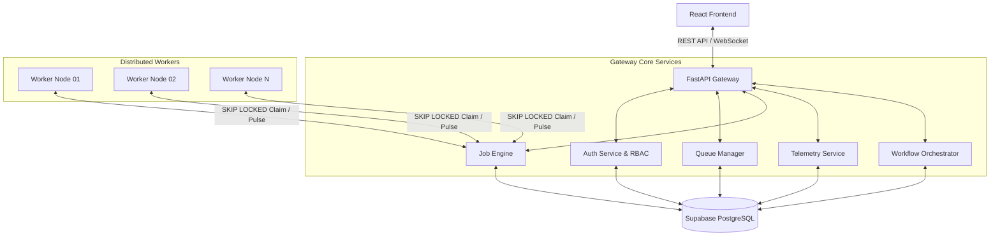

# AetherFlow - Enterprise Distributed Job Scheduling Platform

AetherFlow is a premium, highly scalable, enterprise-grade distributed job scheduling and workflow orchestration platform. It is engineered to coordinate, execute, and monitor complex asynchronous workloads across distributed worker clusters. Built with high-throughput architecture patterns, AetherFlow guarantees ACID compliance, transaction safety, and sub-second task scheduling.

---

## 1. Project Overview

AetherFlow provides developers and system operators with a unified control plane for asynchronous task execution. By substituting heavy message brokers (such as RabbitMQ or Kafka) with PostgreSQL using a highly optimized database-backed queue pattern (`SELECT ... FOR UPDATE SKIP LOCKED`), AetherFlow reduces operations complexity without sacrificing transactional consistency.

The platform provides a state-of-the-art management console featuring real-time WebSocket telemetry, interactive Directed Acyclic Graph (DAG) workflow builders, detailed audit trails, automated retry logic with exponential backoff, dead-letter queue (DLQ) replay managers, and AI-assisted failure diagnostics.



---

## 2. Business Problem & Solution

### The Challenge
In modern microservices and enterprise applications, offloading resource-intensive tasks (e.g., invoice generation, document classification, database cleanups, customer communications) to background workers is essential for maintaining application responsiveness. Traditional approaches rely on dedicated brokers (e.g., Redis/Celery, RabbitMQ) which introduce:
1. **Infrastructure Complexity**: Managing, securing, and scaling separate database and broker clusters.
2. **Distributed Transaction Risks**: Situations where a database transaction commits, but the broker fails to enqueue the corresponding task (or vice-versa).
3. **Black-box Operations**: Inability to easily inspect queue health, edit enqueued job parameters, replay dead-letter messages, or trace audit histories.

### The AetherFlow Solution
AetherFlow resolves these issues by utilizing a single relational database for state storage and queue management:
- **Transactional Enqueueing**: Jobs are enqueued as part of standard database transactions, eliminating the dual-write problem.
- **Skip Locked Lock-Free Worker Pools**: Distributed workers pull tasks concurrently using `SELECT FOR UPDATE SKIP LOCKED` database transactions, avoiding race conditions and starvation.
- **Low-Overhead Observability**: Since jobs reside in database tables, reporting analytics, rendering execution history, and conducting compliance audits are done through simple SQL queries rather than tracking ephemeral logs.

---

## 3. Features Implemented

- **Multi-Tenant Workspace Partitioning**: Organizations (such as "Catalyst") act as isolated spaces. Administrators assign users roles via tenancy mappings.
- **Granular Role-Based Access Control (RBAC)**: Supports roles (`Owner`, `Admin`, `Developer`, `Viewer`) enforced in API middlewares.
- **Concurrency & Rate-Limited Queues**: Configure priority levels, dynamic concurrency limits, and sliding-window rate constraints on a per-queue level.
- **Job Lifecycles & Batch Operations**: Handles immediate, delayed, scheduled (cron-based), and batch jobs. Transition states include `queued`, `running`, `completed`, `retrying`, and `failed`.
- **Autonomous Distributed Workers**: Node agents register, emit periodic heartbeats (CPU, Memory, active task counters), and dynamically scale execution pools.
- **Interactive Workflow DAG Visualizer**: Connects jobs into directed acyclic dependency graphs, executing downstream nodes on success/failure transitions of parents.
- **Real-Time Observability Matrix**: Glassmorphic Grafana-style UI featuring live throughput graphs, system health gauges, activity timelines, and saturation heatmaps.
- **Instant System Alerting Engine**: Real-time server-push notifications over WebSockets displaying worker failure or DLQ events as Toast popups.
- **AI-Assisted Failure Diagnosis**: Rule-based error parsers that map stack traces to categorized causes (e.g., Database Deadlocks, Network Timeouts, Validation Errors), providing recovery forecasts and suggested remedies.
- **Audit Trails & Compliance Log**: Logs administrator changes, configuration adjustments, and user authentications for compliance audits.
- **Exportable Telemetry Reports**: Enables structured system and execution logs download directly from the observability interface.

---

## 4. Technology Stack

### Backend Platform
- **FastAPI**: Async, high-performance API framework.
- **SQLAlchemy 2.0 (Async)**: Modern ORM implementing async session pools.
- **asyncpg**: Database client for PostgreSQL.
- **PostgreSQL**: Supabase hosted 3NF relational engine.
- **Argon2**: Password hashing algorithms.
- **Pytest & AnyIO**: Concurrent backend test suite.

### Frontend Dashboard
- **React 18 & TypeScript**: Component architectures.
- **Vite**: Build pipeline.
- **Zustand**: Clean, hook-based global state management.
- **TanStack React Query**: Automated server-state caching, pre-fetching, and mutation tracking.
- **Recharts**: Responsive data visualization.
- **Framer Motion**: Smooth animations.
- **Tailwind CSS**: Glassmorphic layout system.

---

## 5. Folder Structure

```
distributed-job-scheduler/
├── docker-compose.yml              # Multi-container local orchestration
├── README.md                       # Documentation
├── database/                       # SQL Database Assets
│   ├── schema.sql                  # Main tables DDL
│   ├── constraints.sql             # Alterations, checks, and foreign keys
│   ├── indexes.sql                 # Optimization indices
│   ├── triggers.sql                # Heartbeat and audit trigger scripts
│   ├── functions.sql               # Skipped locked queries and helpers
│   ├── views.sql                   # Observability view tables
│   └── migration.py                # Pure python database schema manager
├── backend/                        # API Engine & Workers
│   ├── alembic.ini                 # Alembic configuration
│   ├── requirements.txt            # Python dependencies
│   ├── scripts/
│   │   ├── seed.py                 # Initial database seeder
│   │   └── seed_demo.py            # High-fidelity enterprise seeder
│   ├── app/
│   │   ├── main.py                 # FastAPI application root & WebSockets
│   │   ├── manager.py              # WebSocket connection manager
│   │   ├── core/                   # Security, auth, config
│   │   ├── db/                     # Async session database connection
│   │   ├── models/                 # SQLAlchemy 2.0 ORM Declarations (core.py)
│   │   ├── schemas/                # Pydantic DTO models (dto.py)
│   │   ├── services/               # Job, Queue, AI, Workflow Services
│   │   └── workers/                # Autonomous worker runner (runner.py)
│   └── tests/                      # Pytest suite
└── frontend/                       # React Web Application
    ├── package.json                # Dependencies
    ├── vite.config.ts              # Vite configurations
    ├── src/
    │   ├── main.tsx                # Entry point
    │   ├── App.tsx                 # Route declarations
    │   ├── components/             # Observability, workflows, charts
    │   ├── contexts/               # WebSocket SocketContext
    │   ├── hooks/                  # TanStack query mappings
    │   ├── layouts/                # Dashboard sidebar wrapper
    │   ├── pages/                  # Dashboard pages (Dashboard, DLQ, etc.)
    │   ├── services/               # Axios API callers
    │   ├── store/                  # Zustand notifications and organizations
    │   └── utils/                  # CSS helpers, Country, Dial-code constants
```

---

## 6. Installation Guide

### Prerequisites
Ensure your local development machine contains:
- **Python 3.11+**
- **Node.js 18+ & npm**
- **PostgreSQL** (Supabase connection URL or local instance)

### Local Manual Installation

#### 1. Backend Setup
1. Navigate to the backend folder:
   ```bash
   cd backend
   ```
2. Create and activate a Python virtual environment:
   ```bash
   python -m venv venv
   # On Windows (PowerShell):
   .\venv\Scripts\Activate.ps1
   # On macOS/Linux:
   source venv/bin/activate
   ```
3. Install dependencies:
   ```bash
   pip install -r requirements.txt
   ```
4. Create a `.env` configuration file in the `backend/` directory:
   ```env
   DATABASE_URL=postgresql+asyncpg://postgres:[PASSWORD]@[HOST]:5432/postgres
   SECRET_KEY=aetherflow_super_secure_development_jwt_secret_key_32_chars
   ALGORITHM=HS256
   ACCESS_TOKEN_EXPIRE_MINUTES=1440
   ```

#### 2. Frontend Setup
1. Navigate to the frontend folder:
   ```bash
   cd ../frontend
   ```
2. Install npm modules:
   ```bash
   npm install
   ```
3. Create a `.env` configuration file in the `frontend/` directory:
   ```env
   VITE_API_URL=http://localhost:8000/api/v1
   ```

---

## 7. Database Initialization & Seeding

### Supabase / PostgreSQL Setup
AetherFlow relies on database-level constraints, indexes, triggers, and helper views.
1. Run the database files against your PostgreSQL server in this sequence:
   - [schema.sql](file:///d:/distributed-job-scheduler/database/schema.sql)
   - [constraints.sql](file:///d:/distributed-job-scheduler/database/constraints.sql)
   - [indexes.sql](file:///d:/distributed-job-scheduler/database/indexes.sql)
   - [functions.sql](file:///d:/distributed-job-scheduler/database/functions.sql)
   - [triggers.sql](file:///d:/distributed-job-scheduler/database/triggers.sql)
   - [views.sql](file:///d:/distributed-job-scheduler/database/views.sql)

*Note: Alternatively, run the pure Python schema manager from the root directory to build the structure:*
```bash
python database/migration.py
```

### Alembic Migrations
If database modifications are introduced:
1. Initialize/Upgrade database to head revision:
   ```bash
   cd backend
   alembic upgrade head
   ```
2. Generate a new revision script after making SQLAlchemy class adjustments:
   ```bash
   alembic revision --autogenerate -m "describe_changes"
   ```

### Enterprise Demo Seeding
To populate the database with realistic, high-fidelity enterprise demo data (featuring users, workspace configurations, historical workloads, active telemetry, heartbeats, logs, alerts, and audit logs):
1. Execute the custom demo seeder:
   ```bash
   cd backend
   # Ensure virtual env is active
   python scripts/seed_demo.py
   ```
This populates the platform with an organization called **Catalyst** running two production platforms (**Customer Communication Platform** and **AI Document Processing Platform**) with 9 users and 4 concurrent workers.

---

## 8. Running the Application

For a fully operational cluster, you must run the API gateway, the React developer server, and at least one worker thread.

### 1. Run Backend API Server
Start the Uvicorn gateway:
```bash
cd backend
python -m uvicorn app.main:app --reload --host 127.0.0.1 --port 8000
```
- Interactive OpenAPI documentation will be hosted at `http://127.0.0.1:8000/docs`.

### 2. Run Autonomous Worker Service
Launch a worker thread to claim and process enqueued jobs:
```bash
cd backend
python -m app.workers.runner
```
*Note: Run this command in multiple terminal tabs to simulate a multi-node worker cluster!*

### 3. Run Frontend Server
Launch the React developer server:
```bash
cd frontend
npm run dev
```
Open `http://localhost:5173` in your browser.

---

## 9. Docker Orchestration

For containerized deployments, AetherFlow provides a pre-configured `docker-compose.yml` linking Postgres, Redis, the API server, the React web app, and background workers.
1. Run the entire stack with a single command from the project root:
   ```bash
   docker-compose up --build
   ```
2. Access the frontend dashboard at `http://localhost:5173`.

---

## 10. Usage & Operation Guide

### Authentication & Tenant Setup
- Sign in with Nithin's seeded credentials (`nithin200511@gmail.com` / `Pymapass@111`) or register a new account.
- Select the **Catalyst** organization in the sidebar picker to view seeded platforms.

### Platform Management
- **Dashboard Overview**: Monitor active projects, queues, workers, live metrics, and real-time failure alerts.
- **Schedules**: Create, pause, resume, and delete recurring tasks (cron or interval-based) that insert jobs into the database.
- **Queues**: Navigate to `/queues` to inspect queue load, adjust concurrency limits, or pause execution pools.
- **Dead-Letter Queue (DLQ)**: View failed tasks that reached retry limits. Inspect traceback summaries, run AI diagnostics, and click "Replay" to return the job to the active queue.
- **Workflows**: Click `/workflows` to visually model job dependencies, track active runs, and monitor parent-child transitions.
- **Audit Logs**: Inspect the `/audit-logs` feed to trace user actions (logins, settings changes, queue adjustments) with before/after diff views.

---

## 11. Automated Testing

### Backend tests (pytest)
Validate authentication, token claims, failure diagnostics, and queue claiming:
```bash
cd backend
pytest tests/ -v
```

### Frontend tests (Vitest)
Verify user states, rendering layers, and form selectors:
```bash
cd frontend
npm run test
```

---

## 12. Troubleshooting & Maintenance

### Mismatched Schema / UndefinedColumnError
- **Symptom**: Database calls raise errors such as `column "workflow_id" does not exist`.
- **Solution**: Run `python scripts/seed_demo.py` to trigger the schema migrations block which automatically creates the missing tables and updates the column relationships on the server.

### WebSocket Disconnection Warnings
- **Symptom**: Metrics do not update live and alerts fail to trigger.
- **Solution**: Ensure your browser network panel allows connections to the gateway path `ws://127.0.0.1:8000/api/v1/ws`. Verify the backend is running.

---

## 13. License

This project is licensed under the MIT License - see the LICENSE file for details.
