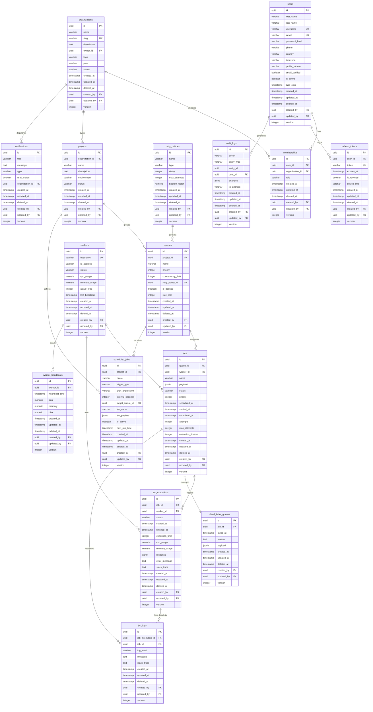

# Distributed Job Scheduler ER Diagram

Below is the complete entity-relationship diagram for the production-ready PostgreSQL 16 schema.

```mermaid
erDiagram
    users {
        uuid id PK
        varchar first_name
        varchar last_name
        varchar username UK
        varchar email UK
        varchar password_hash
        varchar phone
        varchar country
        varchar timezone
        varchar profile_picture
        boolean email_verified
        boolean is_active
        timestamp last_login
        timestamp created_at
        timestamp updated_at
        timestamp deleted_at
        uuid created_by FK
        uuid updated_by FK
        integer version
    }

    organizations {
        uuid id PK
        varchar name
        varchar slug UK
        text description
        uuid owner_id FK
        varchar logo
        varchar plan
        varchar status
        timestamp created_at
        timestamp updated_at
        timestamp deleted_at
        uuid created_by FK
        uuid updated_by FK
        integer version
    }

    memberships {
        uuid id PK
        uuid user_id FK
        uuid organization_id FK
        varchar role
        timestamp created_at
        timestamp updated_at
        timestamp deleted_at
        uuid created_by FK
        uuid updated_by FK
        integer version
    }

    projects {
        uuid id PK
        uuid organization_id FK
        varchar name
        text description
        varchar environment
        varchar status
        timestamp created_at
        timestamp updated_at
        timestamp deleted_at
        uuid created_by FK
        uuid updated_by FK
        integer version
    }

    retry_policies {
        uuid id PK
        varchar name
        varchar type
        integer delay
        integer max_attempts
        numeric backoff_factor
        timestamp created_at
        timestamp updated_at
        timestamp deleted_at
        uuid created_by FK
        uuid updated_by FK
        integer version
    }

    queues {
        uuid id PK
        uuid project_id FK
        varchar name
        integer priority
        integer concurrency_limit
        uuid retry_policy_id FK
        boolean is_paused
        integer rate_limit
        timestamp created_at
        timestamp updated_at
        timestamp deleted_at
        uuid created_by FK
        uuid updated_by FK
        integer version
    }

    workers {
        uuid id PK
        varchar hostname UK
        varchar ip_address
        varchar status
        numeric cpu_usage
        numeric memory_usage
        integer active_jobs
        timestamp last_heartbeat
        timestamp created_at
        timestamp updated_at
        timestamp deleted_at
        uuid created_by FK
        uuid updated_by FK
        integer version
    }

    jobs {
        uuid id PK
        uuid queue_id FK
        uuid worker_id FK
        varchar name
        jsonb payload
        varchar status
        integer priority
        timestamp scheduled_at
        timestamp started_at
        timestamp completed_at
        integer attempts
        integer max_attempts
        integer execution_timeout
        timestamp created_at
        timestamp updated_at
        timestamp deleted_at
        uuid created_by FK
        uuid updated_by FK
        integer version
    }

    scheduled_jobs {
        uuid id PK
        uuid project_id FK
        varchar name
        varchar trigger_type
        varchar cron_expression
        integer interval_seconds
        uuid target_queue_id FK
        varchar job_name
        jsonb job_payload
        boolean is_active
        timestamp next_run_time
        timestamp created_at
        timestamp updated_at
        timestamp deleted_at
        uuid created_by FK
        uuid updated_by FK
        integer version
    }

    job_executions {
        uuid id PK
        uuid job_id FK
        uuid worker_id FK
        varchar status
        timestamp started_at
        timestamp finished_at
        integer execution_time
        numeric cpu_usage
        numeric memory_usage
        jsonb response
        text error_message
        text stack_trace
        timestamp created_at
        timestamp updated_at
        timestamp deleted_at
        uuid created_by FK
        uuid updated_by FK
        integer version
    }

    worker_heartbeats {
        uuid id PK
        uuid worker_id FK
        timestamp heartbeat_time
        numeric cpu
        numeric memory
        numeric disk
        timestamp created_at
        timestamp updated_at
        timestamp deleted_at
        uuid created_by FK
        uuid updated_by FK
        integer version
    }

    job_logs {
        uuid id PK
        uuid job_execution_id FK
        uuid job_id FK
        varchar log_level
        text message
        text stack_trace
        timestamp created_at
        timestamp updated_at
        timestamp deleted_at
        uuid created_by FK
        uuid updated_by FK
        integer version
    }

    dead_letter_queues {
        uuid id PK
        uuid job_id FK
        timestamp failed_at
        text reason
        jsonb payload
        timestamp created_at
        timestamp updated_at
        timestamp deleted_at
        uuid created_by FK
        uuid updated_by FK
        integer version
    }

    notifications {
        uuid id PK
        varchar title
        text message
        varchar type
        boolean read_status
        uuid organization_id FK
        timestamp created_at
        timestamp updated_at
        timestamp deleted_at
        uuid created_by FK
        uuid updated_by FK
        integer version
    }

    audit_logs {
        uuid id PK
        varchar action
        varchar entity_type
        uuid entity_id
        uuid user_id FK
        jsonb changes
        varchar ip_address
        timestamp created_at
        timestamp updated_at
        timestamp deleted_at
        uuid created_by FK
        uuid updated_by FK
        integer version
    }

    refresh_tokens {
        uuid id PK
        uuid user_id FK
        varchar token UK
        timestamp expires_at
        boolean is_revoked
        varchar device_info
        timestamp created_at
        timestamp updated_at
        timestamp deleted_at
        uuid created_by FK
        uuid updated_by FK
        integer version
    }

    users ||--o{ memberships : "has"
    organizations ||--o{ memberships : "contains"
    organizations ||--o{ projects : "owns"
    organizations ||--o{ notifications : "dispatches"
    projects ||--o{ queues : "groups"
    projects ||--o{ scheduled_jobs : "defines"
    retry_policies ||--o{ queues : "governs"
    queues ||--o{ jobs : "enqueues"
    queues ||--o{ scheduled_jobs : "receives"
    workers ||--o{ jobs : "processes"
    workers ||--o{ job_executions : "runs"
    workers ||--o{ worker_heartbeats : "sends"
    jobs ||--o{ job_executions : "triggers"
    jobs ||--o| dead_letter_queues : "moves to"
    jobs ||--o{ job_logs : "records to"
    job_executions ||--o{ job_logs : "logs details to"
    users ||--o{ refresh_tokens : "signs"
    users ||--o{ audit_logs : "generates"
```
